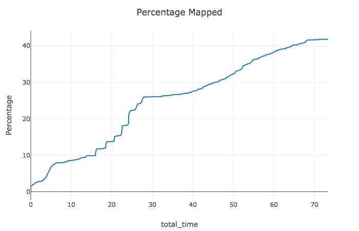

## Project: Search and Sample Return
### Saminda Abeyruwan

### Notebook Analysis
#### 1. Run the functions provided in the notebook on test images (first with the test data provided, next on data you have recorded). Add/modify functions to allow for color selection of obstacles and rock samples.

The notebook, _Rover Project Test Notebook_, provides a sandbox environment to get familiar with
the image processing, and transformations useful for the send part of the project. First, I have used
Udacity provided dataset to work with perspective transformation, and tune the color thresholds. 

Instead of working with the RGB color space, I have used the HSV color space (_cv2.COLOR_RGB2HSV_) - 
based on the experience applying image processing methods presented in the self driving car course.
Since, H is almost constant, I only have to work with S and V channels to tune the color thresholds. 

The empirical evidence has shown that only V channel is enough to select
the navigable area.  


I have used a histogram to find the best threshold for calibration images, and _test_dataset_. 
The function __ground_thresh_with_hsv__ provides the implementation. I have also analysed the 
profiles of S and V channels for non-navigable areas while tuning the threshold. 

I have used both S and V channels to find rocks in __rock_thresh_with_hsv__, and a histogram 
analysis have directly provided the thresholds (please see the notebook).  


#### 2. Populate the `process_image()` function with the appropriate analysis steps to map pixels identifying navigable terrain, obstacles and rock samples into a worldmap.  Run `process_image()` on your test data using the `moviepy` functions provided to create video output of your result. 

As recommended by project video, I have created a _mask_ in __perspect_transform__, which has
been used in __process_image__ to generate the obstacle map. I have followed the instructions
therewith to implement the method and generated the video. 

<p align="center">

</p>

I have collected a training dataset, using the training mode in the simulator with the setting __1024 x 768__, 
__Fastest__, and on a Mac. The parameter, __v_thresh=200__, for __ground_thresh_with_hsv__ worked 
well here as well as the autonomous mode. An example image, perspective transformation, rover coordinate,
and polar coordinate for training image is as follows:


I have used the parameters, __s_thresh = 200, v_thresh_min = 100,__ and __v_thresh_max = 180__ to detect
rocks in test and training images. For example, on my training set -- __1024 x 768__, 
__Fastest__, and __Mac__ -- the image _robocam_2018_07_04_16_05_10_350.png_, and the threshold image 
as follows:


 

### Autonomous Navigation and Mapping

#### 1. Fill in the `perception_step()` (at the bottom of the `perception.py` script) and `decision_step()` (in `decision.py`) functions in the autonomous mapping scripts and an explanation is provided in the writeup of how and why these functions were modified as they were.

I have implemented the __perception_step__ method similar to __process_image__ with color selection
methods and thresholds as before. There are simple modifications such as updating the world map
as follows:

```python
Rover.worldmap[y_world, x_world, 2] += 10
Rover.worldmap[obs_y_world, obs_x_world, 0] += 1
```

I have not changed the implementation available in __decision_step__. 

#### 2. Launching in autonomous mode your rover can navigate and map autonomously.  Explain your results and how you might improve them in your writeup.  

**Note: running the simulator with different choices of resolution and graphics quality may produce different results, particularly on different machines!  Make a note of your simulator settings (resolution and graphics quality set on launch) and frames per second (FPS output to terminal by `drive_rover.py`) in your writeup when you submit the project so your reviewer can reproduce your results.**

I have started the simulator in autonomous mode with the configuration __1024 x 768__, 
__Fastest__, __Mac__, and __FPS 22 to 29__.  The rover maintains at least __40%__ of the environment with __60%__ 
fidelity against the ground truth. It also maps the location of the rock samples. 
I have not changed the __decision_step__ to pick any rocks up, but have them appear in the 
map via __Rover.worldmap[:,:,1]__. One of the example runs for fidelity, percentage mapped, and 
sample located is as follows (using Visdom server):





## Observed problems in the implementation

* During some starts in the autonomous mode, the rover was placed very closed to rocks and it
gets stuck inside the rocks. When you further analyse these situation, you would see that the 
image does not show the rocks or the camera is about the rocks. When this happened, I have 
manually controlled the rover out of the situation. 

* Some situations, the rover circle around in the same mapped environment. I did not update the
_decision_step_ decision step to over come this situation though. If it were to repeat, I have took
manual control of the rover for a few seconds and navigated to a another area.

* There are methods we learned on self driving car course to implement behaviors. In the project, 
I have not investigated on those methods.  


